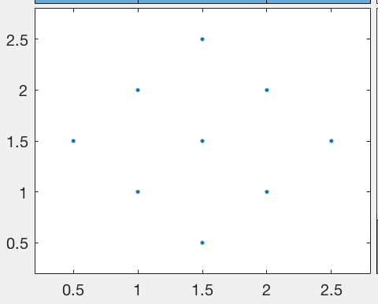

The Grid Problem
================

Cristian Troncoso

Definition
----------

Given a collection of 2D points, create an algorithm that classifies
each point into rows and columns.

Problem Specifications

-   Points form a grid in 2D space.

-   Input points are in no particular order.

-   The grid is square – there are the same number of rows as columns.

-   The grid is fully populated – there are no missing points.

-   The distance between two neighboring points in the same row or
    column is constant.

-   Columns and Rows may or may not be aligned with the x and y axes.

-   The number of columns and rows are arbitrary.

{width="3.55625in" height="2.7197167541557303in"}

Algorithm

1.  Sort the data by increasing order of its x-component.

2.  Find the lowest y-value. If the data is tilted to either side, there
    will always be a lower corner. If the data is aligned with the
    x-axis, the lower corner will be the lowest y with the lowest x
    (because the data is sorted).

3.  Translate the grid to the origin such that the lowest point becomes
    the position (0,0).

4.  Rotate the Grid, either counter-clockwise or clockwise. This will
    depend on the quadrant the grid got translated to. If the grid is
    tilted left, it will be translated to the right quadrant. If the
    grid is tilted right it will be translated to the left quadrant. By
    this point the data is fully transformed into a new aligned grid.

5.  Sort transformed grid by its y-value, so the data will be grouped by
    rows

6.  Grab each group which represent a row and sort it by its transformed
    x-value.

7.  Iterate through each sorted group and label the data with counters
    (I,j).

> Implementation
>
> A Class Data was created to handle the data input; it can feed either
> data from memory or from a file.
>
> A class Point2D was implemented to contain the information for each
> point; original position, transformed position and labels.
>
> Finally, a class Row and Column were implemented to organize the
> points by row or by column.
>
> The algorithm uses encapsulation by delegating the creation of Point2D
> objects to a factory class, Point2DFactory (Factory method pattern).
>
> The most important functions are rotation, and translation, which you
> can see on listing 1.

  -----------------------------------------------------------------------
  /\*
  
  \* @brief Rotate the grid to align it with the xy-axis.It
  
  \* finds the right-most and left-most points and rotate
  
  \* accordingly. Clockwise if left-most is positive, otherwise
  
  \* rotate counter-clockwise.
  
  \* @condition The left-most point previously translated.
  
  \* @param&lt;out&gt; vector of points with new position aligned
  
  \* to the xy-axis
  
  \*/
  
  void rotateGrid(vector&lt;Point2D&gt; &v){
  
  // First,Find right and left most Points.
  
  // Since the vector is sorted by x just get first and last
  
  bool clockwise = true;
  
  Point2D rightMost;
  
  Point2D leftMost;
  
  rightMost.assign(v.at(v.size()-1));
  
  leftMost.assign(v.at(0));
  
  float vec2\[2\];
  
  if(leftMost.getX() &lt; 0.0f){
  
  vec2\[0\]= leftMost.getNewX();
  
  vec2\[1\]= leftMost.getNewY();
  
  clockwise = false;
  
  }else{
  
  vec2\[0\] = rightMost.getNewX();
  
  vec2\[1\] = rightMost.getNewY();
  
  }
  
  float uvec2\[2\];
  
  float norm = sqrt(pow(vec2\[0\],2) + pow(vec2\[1\],2));
  
  uvec2\[0\] = vec2\[0\] / norm;
  
  uvec2\[1\] = vec2\[0\] / norm;
  
  if((uvec2\[0\] == 1.0f || uvec2\[0\] == -1.0f) && uvec2\[1\] == 0.0){
  
  // the grid need no rotation
  
  return;
  
  }else{
  
  // Rotate grid
  
  float dist = sqrt(pow(vec2\[0\],2) + pow(vec2\[1\],2));
  
  float theta = asin(vec2\[1\] / dist);
  
  // Start rotation
  
  for(size\_t i=0; i&lt;v.size(); i++){
  
  Point2D p(v.at(i).getNewX(), v.at(i).getNewY());
  
  float newX;
  
  float newY;
  
  if(clockwise){
  
  newX = p.getX()\*cos(theta) + p.getY()\*sin(theta);
  
  newY = -1\*p.getX()\*sin(theta) + p.getY()\*cos(theta);
  
  }else{
  
  newX = p.getX()\*cos(theta) - p.getY()\*sin(theta);
  
  newY = p.getX()\*sin(theta) + p.getY()\*cos(theta);
  
  }
  
  v.at(i).updateNewPos(newX, newY);
  
  }
  
  }
  
  }
  
  /\*
  
  \* @brief Translate the grid to the origin such that, the
  
  \* point with smallest y-value is set as the origin.
  
  \* When the grid is aligned with the x-axis, the algorithm
  
  \* will choose the leftmost x because the grid is sorted by
  
  \* x values
  
  \*/
  
  void translateGrid(vector&lt;Point2D&gt; &v){
  
  // Find smallest y-value.
  
  Point2D minY(v.at(0).getX(), v.at(0).getY());
  
  for(size\_t i=0; i&lt;v.size(); i++){
  
  Point2D p(v.at(i).getX(), v.at(i).getY());
  
  if(p.getY() &lt; minY.getY())
  
  minY.assign(p);
  
  }
  
  // Translate grid
  
  float translateX = minY.getX();
  
  float translateY = minY.getY();
  
  for(size\_t i=0; i&lt;v.size(); i++){
  
  Point2D p(v.at(i).getX(), v.at(i).getY());
  
  // align min-y with origin
  
  float newX = p.getX() - translateX;
  
  float newY = p.getY() - translateY;
  
  v.at(i).updateNewPos(newX, newY);
  
  }
  
  }
  -----------------------------------------------------------------------

> Listing 1. Rotation and Translation Functions

***Testing***

  -----------------------------------------------------------------------------------------------------
  Data Test Input   Data Test Plot
                    
  1.5000 2.5000     {width="2.446699475065617in" height="1.9675535870516185in"}
                    
  2.0000 2.0000     
                    
  2.5000 1.5000     
                    
  1.0000 2.0000     
                    
  1.5000 1.5000     
                    
  2.0000 1.0000     
                    
  1.5000 0.5000     
                    
  0.5000 1.5000     
                    
  1.0000 1.0000     
  ----------------- -----------------------------------------------------------------------------------
  10.0000 10.0000   {width="2.446699475065617in" height="1.999453193350831in"}
                    
  9.9000 12.0000    
                    
  9.7000 14.0000    
                    
  12.0000 10.1000   
                    
  11.8000 12.1000   
                    
  11.7000 14.1000   
                    
  14.0000 10.3000   
                    
  13.8000 12.3000   
                    
  13.7000 14.3000   
  -----------------------------------------------------------------------------------------------------

  --------------------------------------- -----------------------------------------
  Result                                  Result
                                          
  bash-3.2\$ ./grid                       bash-3.2\$ ./grid
                                          
  (0.5 , 1.5)-&gt;&lt;Row :0,Col :0&gt;   (9.7 , 14)-&gt;&lt;Row :0,Col :0&gt;
                                          
  (1 , 2)-&gt;&lt;Row :0,Col :1&gt;       (11.7 , 14.1)-&gt;&lt;Row :0,Col :1&gt;
                                          
  (1.5 , 2.5)-&gt;&lt;Row :0,Col :2&gt;   (13.7 , 14.3)-&gt;&lt;Row :0,Col :2&gt;
                                          
  (1 , 1)-&gt;&lt;Row :1,Col :0&gt;       (9.9 , 12)-&gt;&lt;Row :1,Col :0&gt;
                                          
  (1.5 , 1.5)-&gt;&lt;Row :1,Col :1&gt;   (11.8 , 12.1)-&gt;&lt;Row :1,Col :1&gt;
                                          
  (2 , 2)-&gt;&lt;Row :1,Col :2&gt;       (13.8 , 12.3)-&gt;&lt;Row :1,Col :2&gt;
                                          
  (1.5 , 0.5)-&gt;&lt;Row :2,Col :0&gt;   (10 , 10)-&gt;&lt;Row :2,Col :0&gt;
                                          
  (2 , 1)-&gt;&lt;Row :2,Col :1&gt;       (12 , 10.1)-&gt;&lt;Row :2,Col :1&gt;
                                          
  (2.5 , 1.5)-&gt;&lt;Row :2,Col :2&gt;   (14 , 10.3)-&gt;&lt;Row :2,Col :2&gt;
  --------------------------------------- -----------------------------------------

Input and Output
----------------

The following program reads a text file containing a set of tuples
representing 2D points and outputs a report to the standard console. It
also calculates the angle between any rows and the x-axis. Main logic is
listed in listing 2

  ----------------------------------------
  bash-3.2\$ ./grid test.txt
  
  Row 0: 10,14 - 12,14 - 14,14
  
  Row 1: 10,12 - 12,12 - 14,12
  
  Row 2: 10,10 - 12,10 - 14,10
  
  Col 0: 10,14 - 10,12 - 10,10
  
  Col 1: 12,14 - 12,12 - 12,10
  
  Col 2: 14,14 - 14,12 - 14,10
  
  Alpha=0 degrees
  
  bash-3.2\$ ./grid grid\_input.txt
  
  Row 0: 9.7,14 - 11.7,14.1 - 13.7,14.3
  
  Row 1: 9.9,12 - 11.8,12.1 - 13.8,12.3
  
  Row 2: 10,10 - 12,10.1 - 14,10.3
  
  Col 0: 9.7,14 - 9.9,12 - 10,10
  
  Col 1: 11.7,14.1 - 11.8,12.1 - 12,10.1
  
  Col 2: 13.7,14.3 - 13.8,12.3 - 14,10.3
  
  0.0748599
  
  Alpha=4.28916 degrees
  ----------------------------------------

  -----------------------------------------------------------------------------------
  int main(int argc, char \*\*argv){
  
  if(argc &lt; 2){
  
  cerr&lt;&lt;" Usage: "&lt;&lt; argv\[0\]&lt;&lt; " File name"&lt;&lt;endl;
  
  exit(1);
  
  }
  
  // Vector containing the final labeled Points
  
  vector&lt;Point2D&gt; grid;
  
  float angle;
  
  // Pull the data out from the data handler
  
  Data \*d = new Data(string(argv\[1\]),1);
  
  vector&lt;pair&lt;float, float&gt;&gt; pairData = d-&gt;getData();
  
  int n = d-&gt;getLength();
  
  // Create 2D Point objects and keep them in a vector pv.
  
  Point2DFactory \*pf = new Point2DFactory(pairData,n);
  
  // get data as 2D points
  
  vector&lt;Point2D&gt; pv = pf-&gt;getPoints();
  
  // To find the lowest Y value, first sort about x. Then, when
  
  // finding lowest Point check if it's the left or right-most
  
  // point
  
  sort(pv.begin(), pv.end(), sortByIncreasingX);
  
  translateGrid(pv);
  
  rotateGrid(pv, angle);
  
  // Sort data by their y-value to organize them by rows
  
  sort(pv.begin(), pv.end(), sortByNewY);
  
  // Label the points with its respective Cols and Rows
  
  int rowLen = sqrt(n); // length of a row
  
  vector&lt;Col&gt; cols(rowLen);
  
  for (int idx=0; idx&lt;n; idx+=rowLen){
  
  vector&lt;Point2D&gt; row;
  
  for(int j=idx; j&lt; (idx+rowLen); j++){
  
  row.push\_back(pv.at(j));
  
  }
  
  sort(row.begin(), row.end(), sortByNewX);
  
  Row R;
  
  for(int r=0; r&lt;rowLen; r++){
  
  R.push(row.at(r));
  
  cols.at(r).push(row.at(r));
  
  }
  
  R.toString();
  
  }
  
  for(int i=0; i&lt;rowLen; i++)
  
  cols.at(i).toString();
  
  cout&lt;&lt;"Alpha="&lt;&lt;angle \* 180.0 / M\_PI&lt;&lt;" degrees"&lt;&lt;endl;
  
  return 0;
  
  }
  -----------------------------------------------------------------------------------

Listing 2
