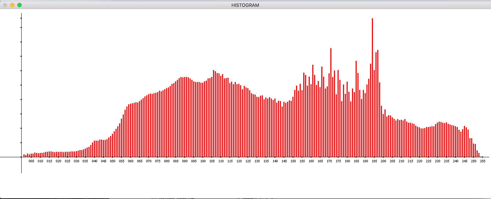

OpenCL Histogram

Cristian Troncoso

This program computes the histogram of an image on the GPU using OpenCL
and displays a graph of the histogram using OpenGL.

The algorithm that calculates the histogram of an image consists on
creating 256 bins to store the counts of 256 different pixel intensities
present in an image.

histogram \[pixel intensity\] ++;

Given the high number of read-modify-write accesses into the data
structure (histogram\[\]) performed by the algorithm, there will be a
great degree of contention of access if the data structure is keep in
global memory. No to mention the latency of accessing the data structure
for each pixel update. Therefore, it is imperative to parallelize the
data structure over a number of workgroups. Given that my Graphic card
allows for 1024 working items, I have parallelized the data structure
into 16 groups of 64 work item each. Each group summarize its work into
a sub-histogram and store it on the chip local memory. These local
sub-histograms are added up after all work-items have reached the second
barrier and reduced into a single global histogram.

